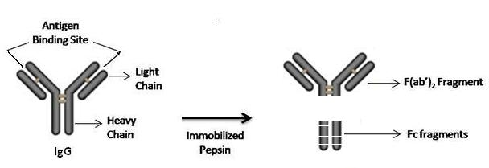

### Theory

Immunoglobulins (antibodies) are serum proteins produced by B cells as an adaptive component of the immune system. They are typically consisted of four amino acid chains-two heavy chains and two light chains that are covalently bonded by intra- and inter-chain disulfide bridges. IgGs are large immunoglobulins of approximately 150 kDa composed of two identical light chains and two identical heavy chains with sizes 25 kDa and 50 kDa respectively with two antigen binding sites.
 
&nbsp;

Antibodies are widely used immunological tool for protein detection and its purification. To study individual parts of antibodies it is better to cleave them into different regions such as Fab, F(ab’)2 and Fc by proteolytic enzymes. It is possible to fragment the Immunoglobulin selectively into fragments which have discrete characteristics. Two widely used immunoglobulin fragments are antigen binding fragments, Fab and class defining fragment, Fc.

&nbsp;

Pepsin is a non specific endopeptidase which is active only at acidic pH. Pepsin cleaves the antibody to produce divalent F(ab’)2 fragment and small peptides of Fc fragment by cleaving the heavy chains near the hinge regions. The resulting F(ab’)2 fragment is comprised of two Fab units joined by disulfide bonds. The light chains remain intact and attached to the heavy chain. This connected F(ab’)2 fragments can be easily separated to monovalent Fab fragments by mild reduction. Fab fragments can conjugated directly through their sulfhydryl groups to detectable labels and ensuring that the active binding sites remains unhindered and active. After fragmentation, the resultant Ig fragments are purified by chromatographic techniques like ion exchange, affinity chromatography, or gel filtration.

 

&nbsp;

 
&nbsp;

**Fragmentation of IgG using Pepsin**

 
